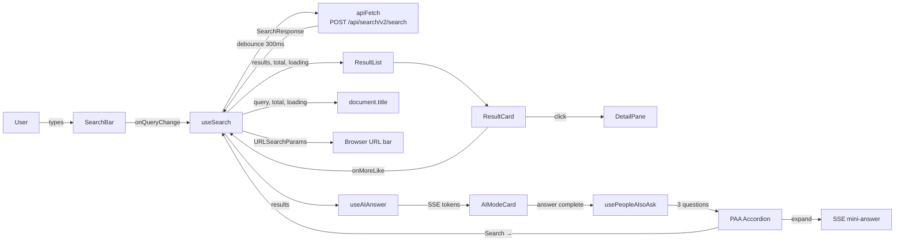
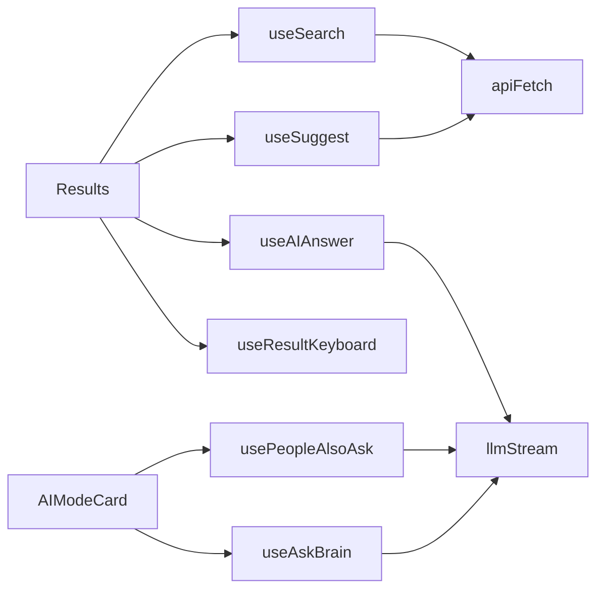
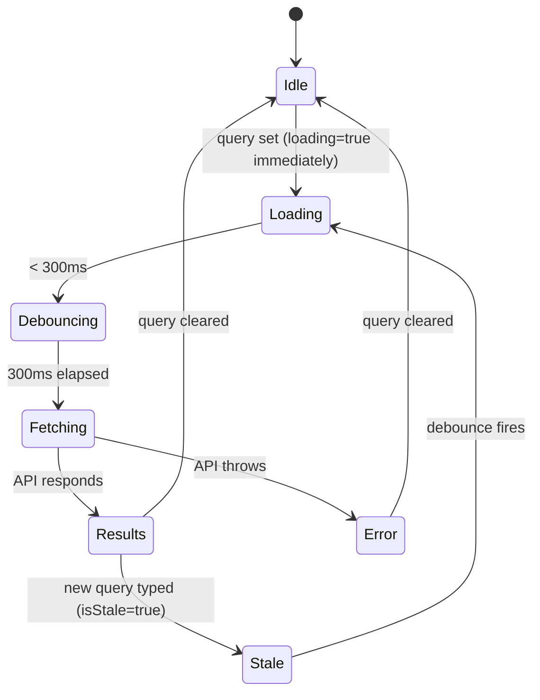
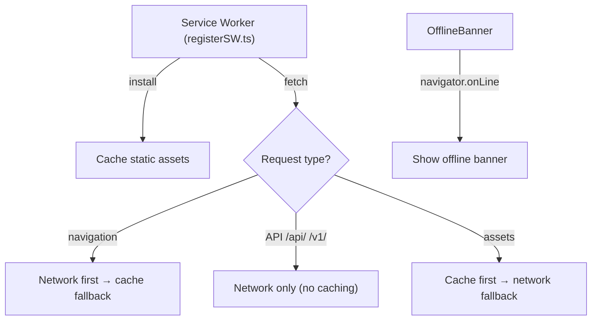

# Architecture — NX Search

> Back to [README](README.md)

## Directory Structure

```
nx-search/
├── public/
│   ├── favicon.svg          # Amber "N" SVG icon
│   └── manifest.json        # PWA manifest
├── src/
│   ├── api/
│   │   ├── client.ts        # apiFetch + llmStream (SSE) primitives
│   │   └── search.ts        # All API calls + LLM helpers
│   ├── components/
│   │   ├── AIModeCard.tsx   # AI answer card (PAA, follow-up, save)
│   │   ├── AISummary.tsx    # Legacy summary display
│   │   ├── AskBrain.tsx     # Inline Ask Brain widget
│   │   ├── AnalyticsPanel.tsx  # Domain hit distribution chart
│   │   ├── CitationText.tsx    # Bold / code / [N] citation renderer
│   │   ├── CollectionsPanel.tsx # Saved answers browser
│   │   ├── CommandPalette.tsx   # ⌘K command palette
│   │   ├── DetailPane.tsx       # Slide-in result detail panel
│   │   ├── DomainFilter.tsx     # Domain pills + DomainBadge
│   │   ├── ErrorBoundary.tsx    # React error boundary
│   │   ├── FilterChips.tsx      # Active-filter chip strip + Clear all
│   │   ├── OfflineBanner.tsx    # Service worker offline indicator
│   │   ├── ProgressBar.tsx      # Animated search progress bar
│   │   ├── ResultCard.tsx       # Single result card + ExpandedModal
│   │   ├── ResultList.tsx       # Virtualisable result list
│   │   ├── SearchBar.tsx        # Query input, suggestions, focus pills
│   │   ├── SidebarFilters.tsx   # Left sidebar (filters, collections, thread)
│   │   ├── Skeleton.tsx         # Loading skeleton cards
│   │   ├── StatsChip.tsx        # Stats display chip
│   │   └── ThreadView.tsx       # Conversation thread viewer
│   ├── hooks/
│   │   ├── useAIAnswer.ts       # Streaming LLM answer + thread
│   │   ├── useAskBrain.ts       # Single-shot Ask Brain query
│   │   ├── usePeopleAlsoAsk.ts  # PAA question generation + mini-answers
│   │   ├── usePrism.ts          # PrismJS lazy-load + highlight
│   │   ├── useResultKeyboard.ts # ↑↓ / o / c / e keyboard navigation
│   │   ├── useSearch.ts         # Core search state + URL sync
│   │   └── useSuggest.ts        # Debounced autocomplete suggestions
│   ├── lib/
│   │   ├── clusterResults.ts    # Group results by domain cluster
│   │   ├── collections.ts       # localStorage saved-answers CRUD
│   │   ├── density.ts           # Result density scoring helper
│   │   ├── highlight.tsx        # Query-term <mark> highlighter
│   │   ├── parseOperators.ts    # Boolean operator parser (domain:, site:)
│   │   ├── recentSearches.ts    # localStorage recent-searches ring buffer
│   │   ├── registerSW.ts        # Service worker registration
│   │   └── theme.ts             # Dark/light theme toggle
│   ├── pages/
│   │   ├── Home.tsx             # Landing page with centered SearchBar
│   │   └── Results.tsx          # Search results page (main orchestrator)
│   ├── test/                    # Vitest unit tests (mirrors src/)
│   ├── types.ts                 # Shared TypeScript interfaces
│   ├── main.tsx                 # React root, router setup
│   └── index.css                # Tailwind directives + custom CSS vars
├── .github/
│   └── workflows/
│       ├── ci.yml               # Tests on every PR / push
│       └── deploy.yml           # Build + rsync to server on main merge
├── nginx.conf                   # Production nginx config with proxy rules
├── Dockerfile                   # Two-stage Node→nginx build
├── docker-compose.yml           # Compose file for local Docker run
└── vite.config.ts               # Vite + proxy + PWA config
```

---

## Core Data Flow



---

## API Client Layer (`src/api/client.ts`)

Two primitives underpin all network calls:

### `apiFetch<T>(path, init?): Promise<T>`

- Prepends `BASE_URL` (always `''` — relative)
- Injects `X-API-Key` header from `VITE_NEURONX_API_KEY`
- Throws on non-2xx with JSON body parsed from response

### `llmStream(path, body, onToken, signal?): Promise<void>`

- Opens SSE via `fetch` with `stream: true`
- Reads `ReadableStream` with `TextDecoder`
- Splits on `data: ` lines, skips `[DONE]`
- Parses `choices[0].delta.content` and calls `onToken(token)`
- Respects `AbortSignal` for cancellation

---

## Hook Dependency Map



---

## Search State Machine (`useSearch`)



Key behaviours:
- `loading` is set **immediately** on query change (not after debounce) so the ProgressBar starts instantly
- `isStale` dims old results at 40% opacity while new fetch is in flight
- All state is synced to `URLSearchParams` so the browser back button works

---

## Proxy Configuration

### Development (`vite.config.ts`)

```
/api/ → https://neuronx.jagatab.uk
/v1/  → https://neuronx.jagatab.uk
```

### Production (`nginx.conf`)

```nginx
location /api/ {
    proxy_pass https://neuronx.jagatab.uk/api/;
    proxy_set_header X-API-Key $http_x_api_key;
}
location /v1/ {
    proxy_pass https://neuronx.jagatab.uk/v1/;
    proxy_buffering off;   # required for SSE
}
```

Using relative URLs everywhere means **zero CORS issues** in both environments.

---

## AI Answer Thread Model

`useAIAnswer` maintains a `thread: Message[]` array that grows with each exchange:

```
thread = [
  { role: "system",    content: FOCUS_PROMPTS[focusMode] },
  { role: "user",      content: "initial query + top-5 snippets" },
  { role: "assistant", content: "first answer" },
  { role: "user",      content: "follow-up question" },
  { role: "assistant", content: "follow-up answer" },
  ...
]
```

Each new `/v1/chat/completions` call sends the **full thread**, giving the LLM full context. `clearThread()` resets to system message only.

---

## PWA Architecture



---

> © 2026 Sree Ganesh Jagatab — All Rights Reserved. See [LICENSE](LICENSE).
