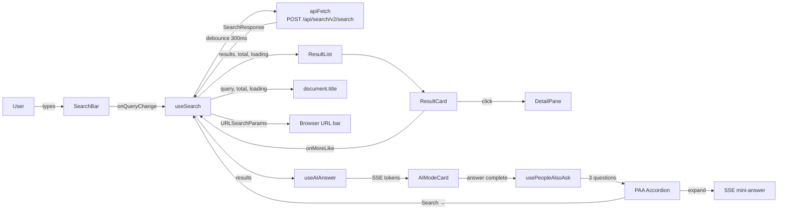
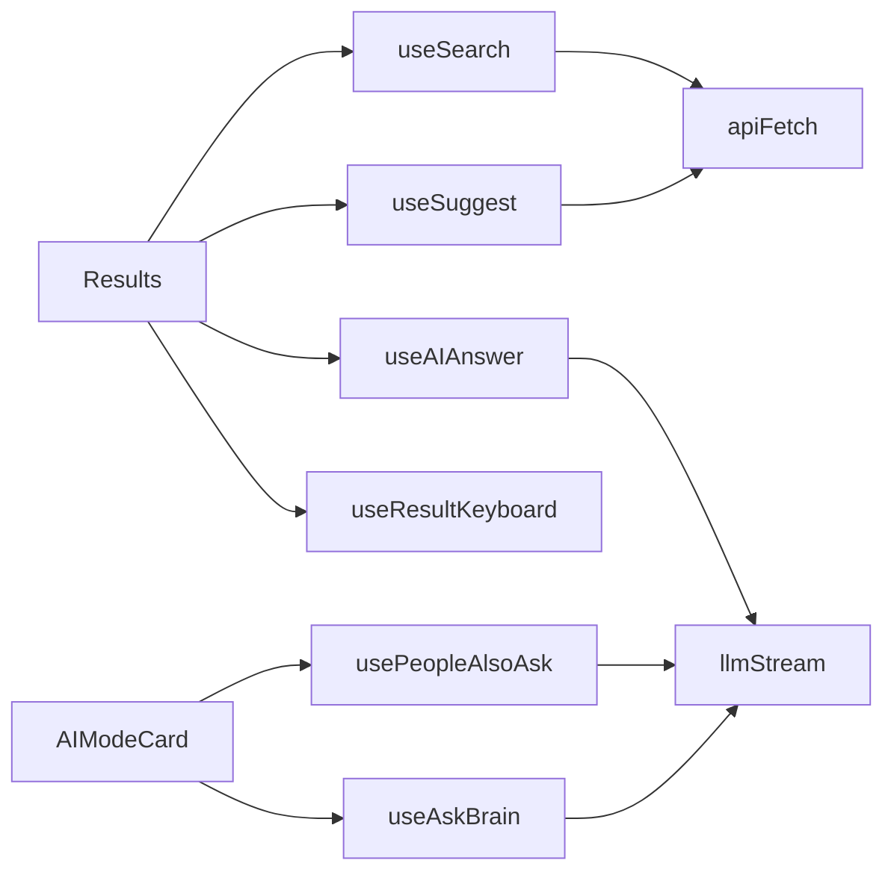
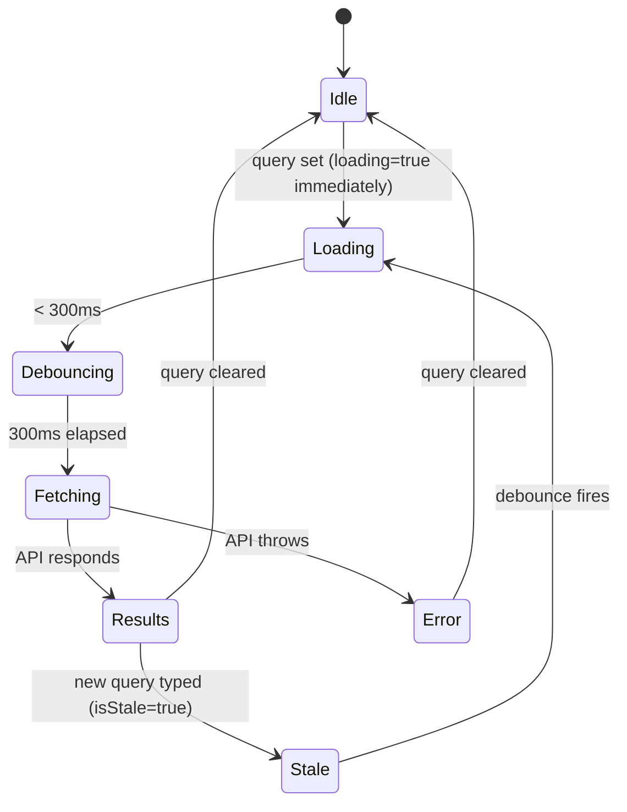
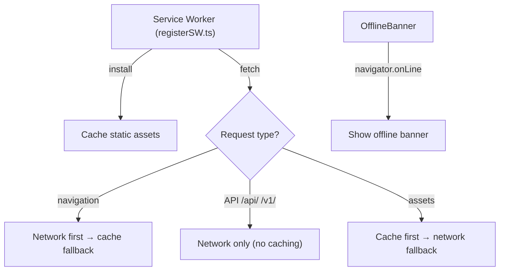

# Architecture — NX Search

> Back to [README](README.md)

## Directory Structure

```
nx-search/
├── public/
│   ├── favicon.svg          # Amber "N" SVG icon
│   └── manifest.json        # PWA manifest
├── src/
│   ├── api/
│   │   ├── client.ts        # apiFetch + llmStream (SSE) primitives
│   │   └── search.ts        # All API calls + LLM helpers
│   ├── components/
│   │   ├── AIModeCard.tsx       # AI answer card: streaming, markdown, PAA, follow-up, save
│   │   ├── AISummary.tsx        # Collapsible plain-text summary (AI Mode off), TTS
│   │   ├── AnswerCompare.tsx    # Side-by-side Concise vs Detailed parallel stream comparison
│   │   ├── AskBrain.tsx         # Ask Brain side panel: markdown, citations, thread, TTS
│   │   ├── AnalyticsPanel.tsx   # Stats tab + Zero Results tab with clear
│   │   ├── CitationText.tsx     # Inline **bold**/`code`/[N] citation with hover popup
│   │   ├── CollectionsPanel.tsx # Saved answers: filter, tags, notes, re-search
│   │   ├── CommandPalette.tsx   # ⌘K: mode/sort/focus/depth/actions/recent fuzzy search
│   │   ├── DeepResearchPanel.tsx# Multi-query synthesis: plan→search→synthesize→report
│   │   ├── DetailPane.tsx       # Slide-in result detail: syntax highlight, share, copy
│   │   ├── DomainFilter.tsx     # Domain checkboxes + pills + DomainBadge
│   │   ├── ErrorBoundary.tsx    # React error boundary with label + retry
│   │   ├── FilterChips.tsx      # Active-filter chip strip + Clear all
│   │   ├── LensesBar.tsx        # Preset + saved filter lenses (domain/mode/sort/confidence)
│   │   ├── OfflineBanner.tsx    # Service worker online/offline banner
│   │   ├── ProgressBar.tsx      # Slow-query progress bar with elapsed timer
│   │   ├── ResultCard.tsx       # Card + hover popover + ExpandedModal + domain prefs
│   │   ├── ResultList.tsx       # Paginated list: sort, cluster, density, local filter
│   │   ├── SearchBar.tsx        # Query input + suggestions + focus pills + voice + trending
│   │   ├── SidebarFilters.tsx   # Domain/source filters, exclude controls, confidence slider
│   │   ├── Skeleton.tsx         # Loading skeleton cards
│   │   ├── StatsChip.tsx        # Patterns · Vectors · Xms display
│   │   ├── ThreadView.tsx       # Conversation thread display
│   │   └── UrlSummarizer.tsx    # URL paste → proxy fetch → streaming LLM summary
│   ├── hooks/
│   │   ├── useAIAnswer.ts       # Streaming LLM answer; thread (MAX 6 pairs); appendExchange
│   │   ├── useAskBrain.ts       # Ask Brain single query; onExchange callback
│   │   ├── useAudioOverview.ts  # Web Speech Synthesis; idle/speaking/paused tri-state
│   │   ├── useDeepResearch.ts   # 3-phase deep research state machine
│   │   ├── usePeopleAlsoAsk.ts  # PAA generation + toggle + mini-answers; abort signal
│   │   ├── usePrism.ts          # PrismJS lazy-load + syntax highlight
│   │   ├── useResultKeyboard.ts # j/k/o/e/Escape card keyboard navigation
│   │   ├── useResultsPage.ts    # All Results.tsx logic: state, effects, handlers, shortcuts
│   │   ├── useSearch.ts         # Core search: debounce, URL sync, LRU cache, fetch-more
│   │   ├── useSuggest.ts        # Debounced suggestions + hover prefetch + trending cache
│   │   ├── useUrlSummarizer.ts  # URL proxy fetch + llmStream + structured output parse
│   │   └── useVoiceSearch.ts    # Web Speech Recognition; idle/listening/error tri-state
│   ├── lib/
│   │   ├── clusterResults.ts    # Group results by similarity gap
│   │   ├── collections.ts       # localStorage saved-answers CRUD
│   │   ├── density.ts           # Result density scoring helper
│   │   ├── domainPrefs.ts       # Boost/block domain preferences (localStorage)
│   │   ├── highlight.tsx        # Shared query-term <mark> highlighter
│   │   ├── lenses.ts            # Lens type + CRUD + PRESET_LENSES
│   │   ├── parseOperators.ts    # Inline operator parser (domain:, -domain:, "phrase", confidence:)
│   │   ├── recentSearches.ts    # localStorage recent/saved searches ring buffer
│   │   ├── registerSW.ts        # Service worker registration
│   │   ├── theme.ts             # System/dark/light theme; initTheme; data-theme attr
│   │   ├── verifyCitations.ts   # Citation key-term overlap verification (40% threshold)
│   │   └── zeroResults.ts       # Zero-result query logging + retrieval (localStorage)
│   ├── pages/
│   │   ├── Home.tsx             # Landing page with centered SearchBar
│   │   └── Results.tsx          # Search results page (main orchestrator)
│   ├── test/                    # Vitest unit tests (mirrors src/)
│   ├── types.ts                 # Shared TypeScript interfaces
│   ├── main.tsx                 # React root, router setup
│   └── index.css                # Tailwind directives + custom CSS vars
├── .github/
│   └── workflows/
│       ├── ci.yml               # Tests on every PR / push
│       └── deploy.yml           # Build + rsync to server on main merge
├── nginx.conf                   # Production nginx config with proxy rules
├── Dockerfile                   # Two-stage Node→nginx build
├── docker-compose.yml           # Compose file for local Docker run
└── vite.config.ts               # Vite + proxy + PWA config
```

---

## Core Data Flow



---

## API Client Layer (`src/api/client.ts`)

Two primitives underpin all network calls:

### `apiFetch<T>(path, init?): Promise<T>`

- Prepends `BASE_URL` (always `''` — relative)
- Injects `X-API-Key` header from `VITE_NEURONX_API_KEY`
- Throws on non-2xx with JSON body parsed from response

### `llmStream(path, body, onToken, signal?): Promise<void>`

- Opens SSE via `fetch` with `stream: true`
- Reads `ReadableStream` with `TextDecoder`
- Splits on `data: ` lines, skips `[DONE]`
- Parses `choices[0].delta.content` and calls `onToken(token)`
- Respects `AbortSignal` for cancellation

---

## Hook Dependency Map



---

## Search State Machine (`useSearch`)



Key behaviours:
- `loading` is set **immediately** on query change (not after debounce) so the ProgressBar starts instantly
- `isStale` dims old results at 40% opacity while new fetch is in flight
- All state is synced to `URLSearchParams` so the browser back button works

---

## Proxy Configuration

### Development (`vite.config.ts`)

```
/api/ → https://neuronx.jagatab.uk
/v1/  → https://neuronx.jagatab.uk
```

### Production (`nginx.conf`)

```nginx
location /api/ {
    proxy_pass https://neuronx.jagatab.uk/api/;
    proxy_set_header X-API-Key $http_x_api_key;
}
location /v1/ {
    proxy_pass https://neuronx.jagatab.uk/v1/;
    proxy_buffering off;   # required for SSE
}
```

Using relative URLs everywhere means **zero CORS issues** in both environments.

---

## AI Answer Thread Model

`useAIAnswer` maintains a `thread: Message[]` array that grows with each exchange:

```
thread = [
  { role: "system",    content: FOCUS_PROMPTS[focusMode] },
  { role: "user",      content: "initial query + top-5 snippets" },
  { role: "assistant", content: "first answer" },
  { role: "user",      content: "follow-up question" },
  { role: "assistant", content: "follow-up answer" },
  ...
]
```

Each new `/v1/chat/completions` call sends the **full thread**, giving the LLM full context. `clearThread()` resets to system message only.

---

## PWA Architecture



---

> © 2026 Sree Ganesh Jagatab — All Rights Reserved. See [LICENSE](LICENSE).
