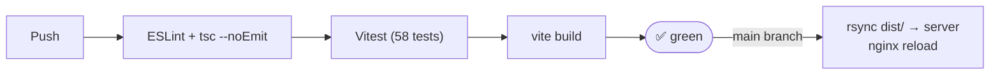

# Contributing — NX Search

> **This is proprietary software.** External contributions are not accepted without prior written agreement from the owner. See [LICENSE](LICENSE).

This guide is for internal collaborators who have been explicitly authorised to work on this codebase.

---

## Development Setup

```bash
git clone https://github.com/sreejagatab/NX-Search.git
cd NX-Search
npm install
cp .env.example .env   # fill in VITE_NEURONX_API_KEY
npm run dev            # http://localhost:3002
```

---

## Branch Workflow

```
main          ← production (protected, deploys automatically)
  └── feat/short-name    ← feature branches
  └── fix/short-name     ← bug fix branches
```

- Branch from `main`, open a PR back to `main`
- CI must pass (58 tests) before merge
- Squash-merge preferred to keep history clean

---

## Coding Standards

| Rule | Detail |
|---|---|
| **No comments by default** | Only add a comment when the WHY is non-obvious |
| **No speculative abstractions** | Three similar lines > premature abstraction |
| **No error handling for impossible cases** | Trust framework guarantees |
| **TypeScript strict** | No `any`, no `@ts-ignore` |
| **Tailwind only** | No inline `style=` except dynamic values (e.g. `width: ${pct}%`) |
| **Relative imports** | `../api/search`, not path aliases |

---

## Testing

```bash
npm test             # single run, all 58 tests
npm run test:watch   # watch mode during development
```

Every new component or hook **must** have a corresponding test in `src/test/`.

Test file conventions:
- `src/test/components/MyComponent.test.tsx`
- `src/test/hooks/useMyHook.test.ts`
- Use `@testing-library/react` for components, plain Vitest for hooks
- Mock only at system boundaries (`vi.mock('../api/search')`)

---

## Commit Message Format

```
type: short imperative description (≤72 chars)

Optional body explaining WHY, not WHAT.

Co-Authored-By: ...
```

Types: `feat` / `fix` / `refactor` / `test` / `docs` / `chore`

---

## CI Pipeline



---

## Adding a New Feature Checklist

- [ ] Feature works end-to-end in dev (`npm run dev`)
- [ ] TypeScript has no errors (`npx tsc --noEmit`)
- [ ] Unit tests written and passing
- [ ] No new `console.log` left in
- [ ] URL state updated if the feature adds persistent UI state
- [ ] Keyboard accessible (focusable, Enter/Escape handled)
- [ ] Tested on mobile viewport (375 px wide)

---

> © 2026 Sree Ganesh Jagatab — All Rights Reserved. See [LICENSE](LICENSE).
