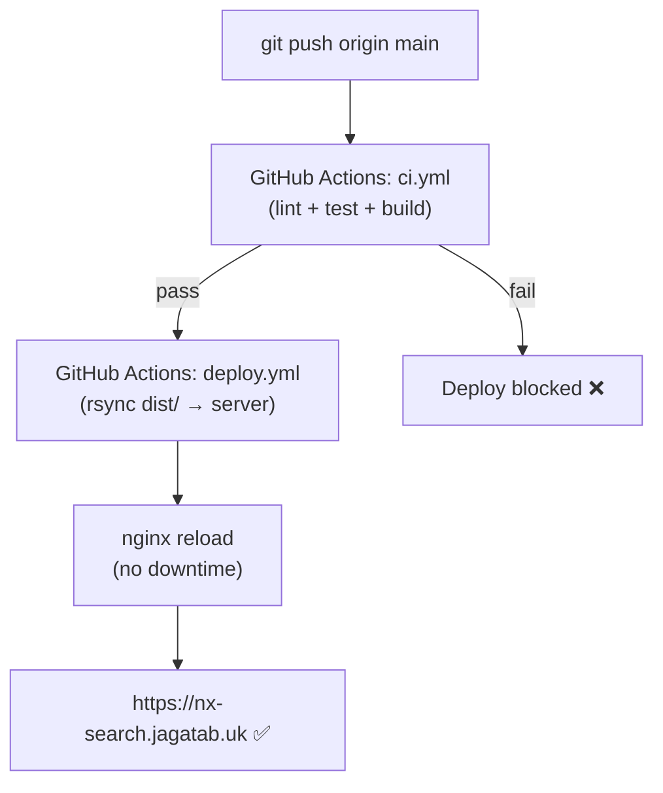

# Deployment Guide — nx-search.jagatab.uk

> Back to [README](README.md) · See also [Architecture](ARCHITECTURE.md)

NX Search deploys automatically via GitHub Actions whenever a commit lands on `main`.
The pipeline builds a static bundle and rsyncs it to the production server behind nginx.

---

## Deployment Flow



---

## One-Time Server Setup

### 1. Create web root

```bash
sudo mkdir -p /var/www/nx-search
sudo chown $USER:$USER /var/www/nx-search
```

### 2. Issue SSL certificate

```bash
sudo certbot certonly --nginx -d nx-search.jagatab.uk
```

### 3. Install nginx config

```bash
sudo cp nginx.conf /etc/nginx/sites-available/nx-search.jagatab.uk
sudo ln -s /etc/nginx/sites-available/nx-search.jagatab.uk \
           /etc/nginx/sites-enabled/nx-search.jagatab.uk
sudo nginx -t && sudo systemctl reload nginx
```

### 4. Allow deploy user to reload nginx without a password

Create `/etc/sudoers.d/nginx-reload`:
```
deploy ALL=(ALL) NOPASSWD: /bin/systemctl reload nginx
```

Or if using a non-systemd server (Docker / custom init):
```
deploy ALL=(ALL) NOPASSWD: /usr/local/bin/reload-nginx
```

---

## GitHub Secrets Required

| Secret | Where to get it |
|---|---|
| `SSH_PRIVATE_KEY` | Private half of deploy SSH keypair (see below) |
| `SSH_KNOWN_HOSTS` | `ssh-keyscan YOUR_SERVER_IP` |
| `SSH_USER` | SSH username on the server |
| `SSH_HOST` | Server IP or hostname |
| `DEPLOY_PATH` | `/var/www/nx-search` |
| `VITE_NEURONX_API_KEY` | NeuronX dashboard |

---

## Generating the Deploy SSH Key

```bash
# On your local machine — generate a dedicated deploy key
ssh-keygen -t ed25519 -C "gh-actions-nx-search" -f ~/.ssh/nx_search_deploy

# Authorise the public key on the server
ssh-copy-id -i ~/.ssh/nx_search_deploy.pub USER@YOUR_SERVER

# Print the private key — paste as GitHub secret SSH_PRIVATE_KEY
cat ~/.ssh/nx_search_deploy

# Get known_hosts value — paste as GitHub secret SSH_KNOWN_HOSTS
ssh-keyscan YOUR_SERVER_IP
```

---

## DNS

Add an A record in your DNS provider:

```
nx-search.jagatab.uk  A  YOUR_SERVER_IP  TTL: 300
```

Propagation typically takes 1–5 minutes with a short TTL.

---

## nginx Configuration Reference

Key sections in `nginx.conf`:

```nginx
# Proxy all /api/* to NeuronX backend (no CORS)
location /api/ {
    proxy_pass         https://neuronx.jagatab.uk/api/;
    proxy_set_header   Host neuronx.jagatab.uk;
    proxy_set_header   X-API-Key $http_x_api_key;
}

# Proxy /v1/* (LLM SSE) — buffering must be off for streaming
location /v1/ {
    proxy_pass         https://neuronx.jagatab.uk/v1/;
    proxy_buffering    off;
    proxy_cache        off;
    proxy_set_header   Connection '';
    chunked_transfer_encoding on;
}

# SPA fallback — all unmatched routes → index.html
location / {
    try_files $uri $uri/ /index.html;
}
```

---

## Rollback

If a bad build goes out:

```bash
# On the server — restore previous dist from backup
ls /var/www/nx-search-backup/
rsync -a /var/www/nx-search-backup/ /var/www/nx-search/
sudo systemctl reload nginx
```

CI keeps the last 10 build artifacts in GitHub Actions — download and re-deploy manually if needed.

---

## Docker (Alternative)

For a self-contained deploy on any VPS:

```bash
# Build
docker compose build

# Run (maps port 3002 → 80 inside container)
VITE_NEURONX_API_KEY=your_key docker compose up -d

# Update
git pull
docker compose up --build -d
```

The `Dockerfile` uses a two-stage build:
1. **Stage 1 — builder**: `node:20-alpine` → `npm ci && npm run build` → `dist/`
2. **Stage 2 — server**: `nginx:alpine` → copies `dist/` + `nginx.conf`

Final image is ~25 MB.

---

> © 2026 Sree Ganesh Jagatab — All Rights Reserved. See [LICENSE](LICENSE).
