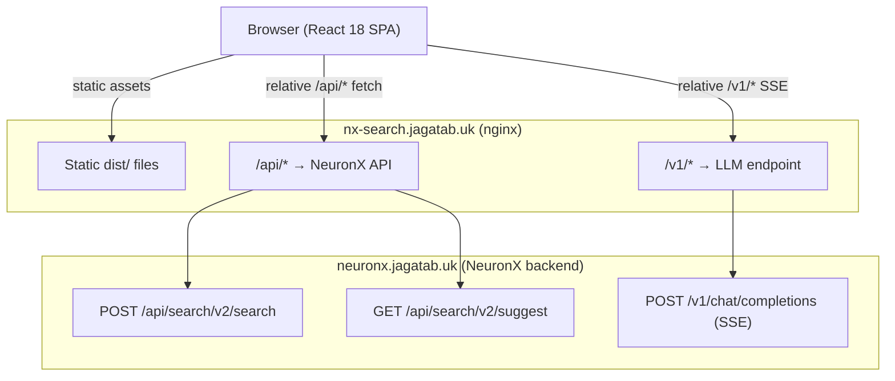
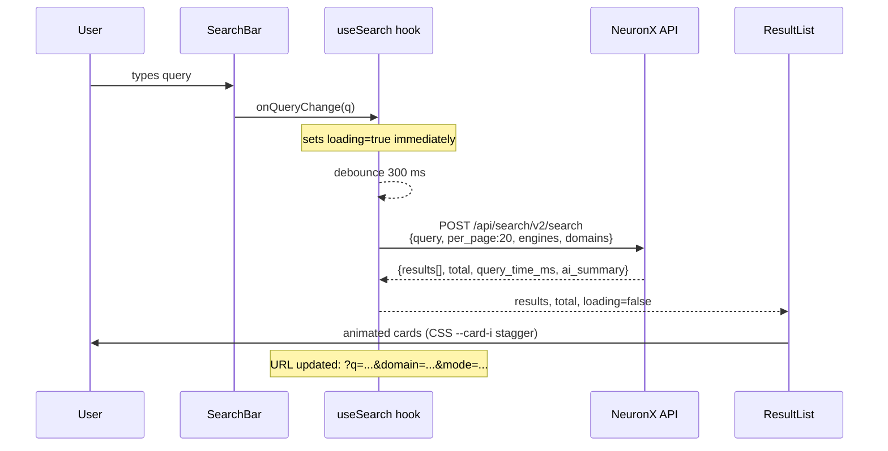
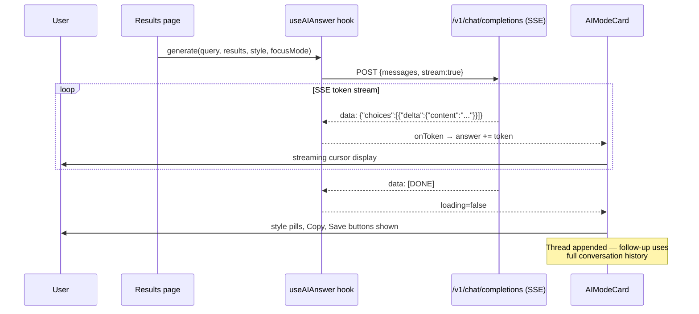
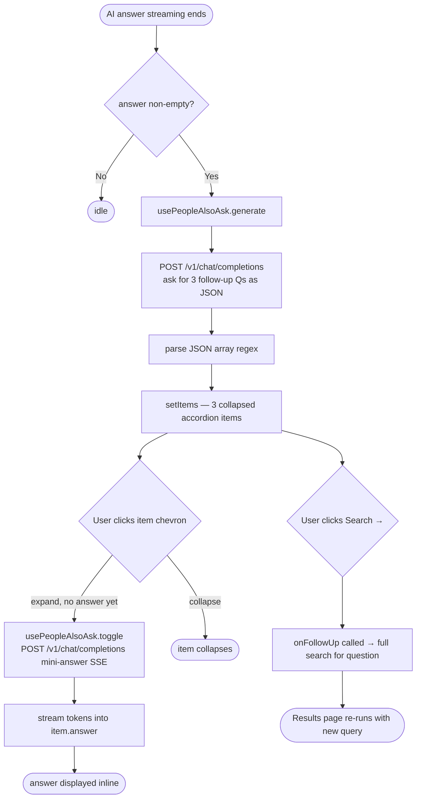
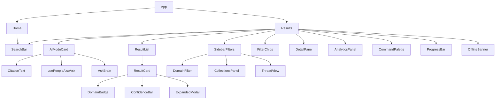

# NX Search — NeuronX Semantic Search UI

> **Proprietary software. All rights reserved. See [LICENSE](LICENSE) before use.**

A production-grade semantic search front-end over the [NeuronX](https://neuronx.jagatab.uk) knowledge engine — 257 K learned patterns, 210 K FAISS vectors, 16 domains — with a real-time AI answer layer, rich filtering, and a PWA shell.

**Live:** https://nx-search.jagatab.uk &nbsp;|&nbsp;
**API backend:** https://neuronx.jagatab.uk &nbsp;|&nbsp;
**Docs:** [Architecture](ARCHITECTURE.md) · [Deployment](DEPLOY.md) · [Contributing](CONTRIBUTING.md) · [Security](SECURITY.md)

---

## Table of Contents

- [Feature Overview](#feature-overview)
- [System Architecture](#system-architecture)
- [Search Flow](#search-flow)
- [AI Answer Pipeline](#ai-answer-pipeline)
- [People Also Ask Flow](#people-also-ask-flow)
- [Component Hierarchy](#component-hierarchy)
- [URL State & Deep Links](#url-state--deep-links)
- [Keyboard Shortcuts](#keyboard-shortcuts)
- [Quick Start](#quick-start)
- [Environment Variables](#environment-variables)
- [Scripts](#scripts)
- [Docker](#docker)
- [Tech Stack](#tech-stack)

---

## Feature Overview

| Category | Features |
|---|---|
| **Search** | Semantic (FAISS vector), Pattern (keyword), Hybrid mode |
| **AI** | Streaming AI answer (Brain 72B), concise / detailed / bullets styles, thread memory |
| **PAA** | People Also Ask — auto-generated follow-up questions with mini-answers + full-search link |
| **Filters** | Domain pills, source chips, sort (similarity / confidence / domain), "Clear all" |
| **Navigation** | URL-synced state, shareable links, browser back/forward, deep-link to result |
| **UX** | Command palette (`⌘K`), keyboard nav, hover preview popover, focus modes (All / Web / Quick) |
| **Collections** | Save AI answers, browse & re-open saved sessions |
| **Analytics** | Per-domain hit distribution chart, query-time badge |
| **PWA** | Service worker, offline banner, installable |
| **DX** | 58 unit tests (Vitest + Testing Library), TypeScript strict, Tailwind v3 |

---

## System Architecture



> All API calls use **relative URLs** — the browser never makes cross-origin requests.
> Both the Vite dev proxy (`vite.config.ts`) and the nginx proxy (`nginx.conf`) route transparently.

---

## Search Flow



---

## AI Answer Pipeline



---

## People Also Ask Flow



---

## Component Hierarchy



---

## URL State & Deep Links

Every search parameter is reflected in the URL and restored on page load:

| Param | Example | Description |
|---|---|---|
| `q` | `?q=async+python` | Search query |
| `domain` | `&domain=python` | Active domain filter |
| `mode` | `&mode=semantic` | `semantic` / `pattern` / `hybrid` |
| `focus` | `&focus=web` | `research` / `web` / `quick` |
| `result` | `&result=abc123` | Opens DetailPane for that result ID |

Shareable example:
```
https://nx-search.jagatab.uk/results?q=rust+async&domain=rust&mode=semantic
```

---

## Keyboard Shortcuts

| Key | Action |
|---|---|
| `/` | Focus search bar |
| `Escape` | Clear query / close modal |
| `Enter` | Submit search |
| `↑` / `↓` | Navigate result cards |
| `o` | Open focused result in DetailPane |
| `c` | Copy focused result content |
| `e` | Explain focused result with AI |
| `⌘K` / `Ctrl+K` | Open Command Palette |

---

## Quick Start

```bash
# 1. Clone
git clone https://github.com/sreejagatab/NX-Search.git
cd NX-Search

# 2. Install
npm install

# 3. Configure
cp .env.example .env
# Edit .env — set VITE_NEURONX_API_KEY

# 4. Develop
npm run dev          # http://localhost:3002

# 5. Test
npm test             # 58 unit tests via Vitest
```

---

## Environment Variables

| Variable | Required | Default | Description |
|---|---|---|---|
| `VITE_NEURONX_API_KEY` | Yes | — | API key sent as `X-API-Key` header |
| `VITE_NEURONX_API_URL` | No | `''` (relative) | Override API base URL (advanced) |

> The app uses **relative URLs by default**. Do not set `VITE_NEURONX_API_URL` to an absolute URL unless you know what you are doing — it will break CORS.

---

## Scripts

| Script | Description |
|---|---|
| `npm run dev` | Vite dev server with HMR on port 3002 |
| `npm run build` | TypeScript compile + Vite production build → `dist/` |
| `npm run preview` | Serve `dist/` locally for final verification |
| `npm test` | Run all 58 tests (Vitest, single run) |
| `npm run test:watch` | Vitest watch mode |
| `npm run lint` | ESLint + TypeScript checks |

---

## Docker

```bash
# Build and run (production image, nginx inside)
docker compose up --build

# Pass API key at runtime
VITE_NEURONX_API_KEY=your_key docker compose up --build
```

The Dockerfile uses a **two-stage build**: Node 20 Alpine to compile, then nginx:alpine to serve `dist/` — final image is ~25 MB.

---

## Tech Stack

| Layer | Technology |
|---|---|
| Framework | React 18 + TypeScript 5 |
| Build | Vite 5 |
| Routing | React Router v6 |
| Styling | Tailwind CSS v3 |
| Testing | Vitest + Testing Library |
| Syntax highlight | PrismJS (lazy-loaded) |
| Icons | Inline SVG / Unicode |
| AI streaming | SSE via `ReadableStream` / `TextDecoder` |
| Vector search | NeuronX FAISS backend (external) |
| CI/CD | GitHub Actions → nginx deploy |
| PWA | Vite PWA plugin + custom SW |

---

> © 2026 Sree Ganesh Jagatab — All Rights Reserved. See [LICENSE](LICENSE).
